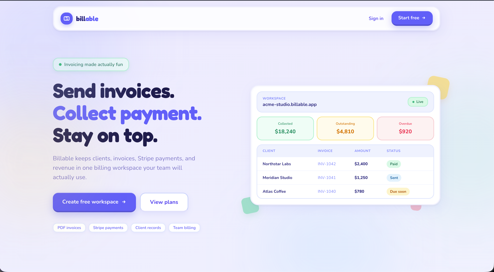
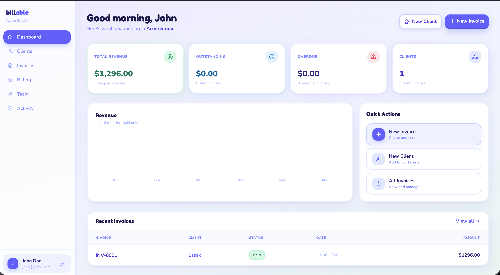
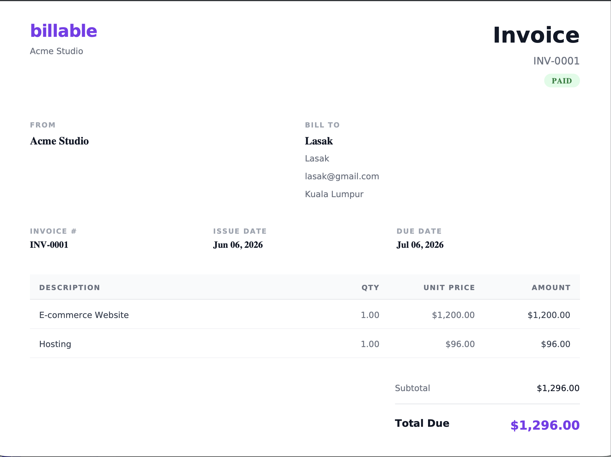

# Billable

> A multi-tenant SaaS invoicing platform for small teams. Sign up on the central app, create a workspace, pick a plan, and manage clients, invoices,  > payments, team members, and billing from a dedicated tenant subdomain.


---

## Preview

| Landing | Dashboard | Invoice |
|---|---|---|
|  |  |  |

---

## About

Billable is a domain-based multi-tenant SaaS. A user registers on the central app, creates a workspace, chooses a billing plan, and then works from a dedicated tenant subdomain.

Example domains:

- Central app: `https://billable.test`
- Tenant app: `https://acme-studio.billable.test`

The **central domain** owns public marketing pages, authentication, onboarding, plan selection, subscription webhooks, SEO files, and the Filament admin panel. **Tenant domains** own workspace features such as dashboard, billing, clients, invoices, team, activity, and public invoice payment links.

> Important: `https://billable.test/dashboard` returns `404`. `/dashboard` is a tenant route, so use the tenant domain, e.g. `https://acme-studio.billable.test/dashboard`.

---

## Features

- Central landing page with SEO metadata, `robots.txt`, and `sitemap.xml`.
- Central registration, login, logout, and onboarding with rate limiting on all auth routes.
- Email verification with resend support — tenant and billing routes are gated behind the `verified` middleware.
- Password reset flow with signed reset link and Inertia pages.
- Workspace creation with reserved-subdomain validation, automatic tenant database creation, and tenant migration.
- Free, Pro, and Business plans seeded into the central database, with central and tenant subscription flows through Laravel Cashier and Stripe.
- Tenant subscription gate that allows `/billing` recovery while protecting app routes.
- Subscription cancellation webhook — `customer.subscription.deleted` resets the workspace owner's plan and clears subscription caches.
- Tenant dashboard with revenue, outstanding, overdue, draft, client, recent invoice, and recent activity data.
- Client CRUD with soft archive and invoice history.
- Invoice CRUD with line items, discounts, tax, totals, PDF download (rate limited), queued send action, and queued reminder action.
- Invoice CSV export at `/invoices/export` with optional `status`, `client_id`, `from`, and `to` filters.
- Auto-overdue job that transitions sent invoices past their due date to `overdue` daily at `00:01`.
- Public tenant invoice payment page at `/pay/{token}` with throttled Payment Intent creation — draft, cancelled, and deleted invoices return 404.
- Stripe `payment_intent.succeeded` webhook with logging, idempotency checks, tenant resolution, and a queued payment receipt email.
- Workspace activity log for billing, clients, invoices, reminders, payments, and team changes.
- Team member management with owner/member roles and permission-aware Inertia navigation.
- Filament admin panel for workspaces, plans, subscription stats, MRR, and user counts.

### Plan Limits

Plan limits are enforced at creation time by `PlanLimitsService`, called from `CreateClient` and `CreateInvoice`.

| Plan | Client limit | Invoice limit |
| --- | --- | --- |
| Free | 3 total | 5 per month |
| Pro | Unlimited | Unlimited |
| Business | Unlimited | Unlimited |

When a limit is exceeded, `PlanLimitExceededException` is thrown and the global exception handler redirects back with a user-facing error message. Existing data is never deleted or hidden on downgrade — limits only gate new creation.

### Roles and Permissions

Roles and permissions are central-database records powered by `spatie/laravel-permission`.

| Role | Access |
| --- | --- |
| `owner` | Receives every workspace permission. |
| `member` | Can view activity and billing, create/update/view clients and invoices, send invoices, and send reminders. Cannot manage team, manage billing, or delete clients/invoices. |

Permission groups: `activity.view`, `billing.view`, `billing.manage`, `clients.view`, `clients.create`, `clients.update`, `clients.delete`, `invoices.view`, `invoices.create`, `invoices.update`, `invoices.delete`, `invoices.send`, `invoices.remind`, `team.view`, `team.manage`.

Server-side enforcement uses `ClientPolicy`, `InvoicePolicy`, and Gates for billing/team/activity abilities. Frontend gating uses shared Inertia `permissions` props from `HandleInertiaRequests` — treat those as UI visibility only; policies and server checks are the real enforcement layer.

Team members do not inherit the owner's billing plan. Their `plan` column is always `null`; `EnsureSubscribed` checks the workspace owner's subscription when a member's own plan is null.

---

## Tech Stack

| Layer | Tech |
| --- | --- |
| Backend | Laravel 13, PHP `^8.3` |
| Frontend | Inertia.js 3, Vue 3, Tailwind CSS 4, Vite 8 |
| Package/runtime tooling | Composer, Bun |
| Tenancy | `stancl/tenancy` 3, domain-based tenant identification |
| Database | PostgreSQL central database plus PostgreSQL tenant databases |
| Billing subscriptions | Laravel Cashier 16, Stripe Checkout, Stripe Billing Portal |
| Invoice payments | Stripe Payment Intents and a tenant-aware custom webhook |
| Queues | Laravel database queue, stored on the central connection |
| Roles and permissions | `spatie/laravel-permission` with central role/permission tables |
| Admin panel | Filament 5 |
| PDF generation | `barryvdh/laravel-dompdf` |
| Code style | Laravel Pint |
| Tests and CI | PHPUnit 12, GitHub Actions |

The CI workflow currently uses PHP 8.5. Local PHP only needs to satisfy Composer's `^8.3` constraint unless a dependency update raises that requirement.

---

## System Flow

This project follows a type-based Laravel structure (no `Domains` folder). Classes are placed by responsibility, and controllers stay thin.

Preferred request flow:

```txt
Controller
-> Form Request
-> Action
-> Model / Support class
-> Inertia page / redirect / response
```

Business workflows live in `app/Actions`, reusable calculations in `app/Support` or `app/Services`, reusable complex reads in `app/Queries`, and page preparation in `app/ViewModels`.

Representative examples:

- `app/Actions/Tenant/CreateWorkspace.php` creates the tenant, stores the domain, and assigns owner access.
- `app/Actions/Invoice/CreateInvoice.php` creates invoice headers, items, totals, and activity — enforces plan limits before creation.
- `app/Actions/Invoice/MarkInvoicePaid.php` marks tenant invoices paid after Stripe confirms payment.
- `app/Actions/Invoice/MarkOverdueInvoices.php` loops all tenants and transitions due sent invoices to overdue.
- `app/Jobs/Invoice/*` sends invoice, reminder, and payment receipt emails from the queue.
- `app/Queries/Tenant/*` contains tenant listing reads for clients, invoices, activity, team members, and billing owners.
- `app/Services/InvoiceNumberService.php` issues tenant invoice numbers from a locked sequence row.
- `app/Services/PlanLimitsService.php` reads the workspace owner's plan and enforces per-plan limits.
- `app/Support/InvoiceTotals.php` centralizes subtotal, discount, tax, and total calculations.

### Project Structure

```txt
app/
├── Actions/        (Activity, Auth, Billing, Client, Invoice, Team, Tenant)
├── Concerns/
├── Enums/
├── Exceptions/
├── Filament/       (Resources, Widgets)
├── Http/
│   ├── Controllers/ (Auth, Billing, Payment, Seo, Stripe, Tenant)
│   ├── Middleware/
│   └── Requests/
├── Jobs/Invoice/
├── Mail/
├── Models/
├── Policies/
├── Providers/
├── Queries/Tenant/
├── Services/
├── Support/
└── ViewModels/Tenant/

database/
├── migrations/
├── migrations/tenant/
└── seeders/

resources/js/
├── Components/
├── Layouts/
└── Pages/         (Auth, Billing, Onboarding, Payment, Tenant)

routes/
├── web.php        (central)
├── tenant.php     (tenant, loaded by TenancyServiceProvider)
└── console.php    (scheduled commands)
```

### Implementation Notes

- `config/tenancy.php` defines `billable.test`, `localhost`, and `127.0.0.1` as central domains.
- Tenant identification uses `InitializeTenancyByDomain` and `PreventAccessFromCentralDomains`. `tenant.active` blocks all tenant routes when a workspace is suspended.
- `tenants.name` and `tenants.is_suspended` are real central database columns, not only values in Stancl's `data` JSON.
- `Stancl\Tenancy\Features\ViteBundler::class` is enabled so tenant pages use normal Vite build assets (`/build/assets/...`).
- `App\Support\AppUrl` builds central URLs, tenant domains, and tenant URLs from `APP_URL`.
- `App\Concerns\HasTenantAccess` resolves tenant membership, owner checks, permissions, and tenant URLs.
- `CreateInvoice` and `UpdateInvoice` wrap multi-table invoice writes in database transactions.
- Tenant invoice numbers are issued from `invoice_number_sequences` with `lockForUpdate()` instead of `count() + 1`.
- `CashierWebhookController` overrides `handleCustomerSubscriptionDeleted` to reset `user.plan` to `null` and clear the `tenant_owner_plan_*` and `tenant_owner_*` cache keys when a subscription is cancelled.
- `EnsureSubscribed` caches the workspace owner lookup per tenant for 5 minutes (`tenant_owner_{id}`); `PlanLimitsService` caches the owner plan lookup per tenant for 5 minutes (`tenant_owner_plan_{id}`).
- Paid plan Stripe Price IDs are configured through `config/billing.php` from `STRIPE_PRICE_PRO` and `STRIPE_PRICE_BUSINESS`.
- The custom invoice webhook reads `STRIPE_INVOICE_WEBHOOK_SECRET`, falling back to `STRIPE_WEBHOOK_SECRET` when no separate secret is configured. Both webhooks fail closed when their signing secret is missing.
- `routes/console.php` schedules `invoices:mark-overdue` (daily `00:01`) and `invoices:send-reminders` (daily `09:00`), both with `withoutOverlapping()`.
- Invoice/reminder/receipt emails are queued via `app/Jobs/Invoice` with `$tries = 3` and exponential backoff of `[30, 60, 120]` seconds. Database queue jobs use `DB_QUEUE_CONNECTION`, which should stay on the central connection.

---

## Database Overview

Billable uses one **central** PostgreSQL database plus one **tenant** PostgreSQL database per workspace (created automatically by Stancl Tenancy on workspace creation).

### Central database

| Table | Purpose |
| --- | --- |
| `users` | Accounts; holds `plan`, `tenant_id`, `is_admin`, and Cashier customer columns. |
| `tenants` | Workspaces; includes `name`, `is_suspended`, and workspace status columns. |
| `domains` | Maps tenant domains to workspaces. |
| `plans` | Free / Pro / Business plans and their Stripe Price IDs. |
| `subscriptions`, `subscription_items` | Laravel Cashier subscription state (with meter columns). |
| `roles`, `permissions`, `model_has_*`, `role_has_permissions` | Spatie roles and permissions. |
| `stripe_events` | Processed Stripe event IDs for webhook idempotency. |
| `cache`, `jobs`, `sessions`, `password_reset_tokens` | Framework tables (cache, database queue, sessions, auth). |

### Tenant database (per workspace)

| Table | Purpose |
| --- | --- |
| `clients` | Workspace clients (soft-archivable). |
| `invoices` | Invoices with status, totals, payment fields, reminder fields, and `paid_at`. |
| `invoice_items` | Line items belonging to an invoice. |
| `invoice_number_sequences` | Locked per-tenant invoice number counter. |
| `activity_logs` | Workspace activity feed for billing, clients, invoices, reminders, payments, and team changes. |

---

## API Endpoints

### Central routes (`routes/web.php`)

```txt
/                         Landing page
/register                 Register (throttle: 10/min)
/login                    Login (throttle: 5/min)
/logout                   Logout
/forgot-password          Password reset request (throttle: 5/min)
/reset-password/{token}   Password reset form + submit (throttle: 5/min)
/email/verify             Email verification notice
/email/verify/{id}/{hash} Email verification link (signed)
/onboarding               Workspace onboarding
/plans                    Central plan selection
/billing/success          Central subscription return
/billing/portal           Central billing portal
/robots.txt               Robots file
/sitemap.xml              Sitemap
/stripe/webhook           Cashier subscription webhook (CashierWebhookController)
/stripe/invoice-webhook   Custom invoice-payment webhook
/admin                    Filament admin panel
```

### Tenant routes (`routes/tenant.php`)

```txt
/dashboard                         Workspace dashboard
/billing                           Tenant billing overview
/billing/portal                    Tenant billing portal
/billing/plans/{plan}/subscribe    Tenant plan checkout
/clients                           Client CRUD
/invoices                          Invoice CRUD
/invoices/export                   CSV export (throttle: 10/min)
/invoices/{invoice}/send           Send invoice email
/invoices/{invoice}/remind         Send invoice reminder
/invoices/{invoice}/pdf            Download invoice PDF (throttle: 20/min)
/team                              Team management
/activity                          Activity log
/pay/{token}                       Public invoice payment page (throttle: 60/min)
/pay/{token}/intent                Public Payment Intent endpoint (throttle: 10/min)
```

Tenant routes use `InitializeTenancyByDomain`, `PreventAccessFromCentralDomains`, `tenant.member`, and `subscribed` (for protected product routes). The public invoice payment routes are tenant routes but do not require login.

---

## Getting Started

### Prerequisites

- PHP `^8.3`
- Composer
- PostgreSQL
- Bun
- Laravel Herd for local `.test` domains
- Stripe CLI for local webhook forwarding

### 1. Install dependencies

```bash
composer install
bun install
```

### 2. Create environment file

```bash
cp .env.example .env
php artisan key:generate
```

Recommended local values:

```env
APP_NAME=Billable
APP_ENV=local
APP_URL=https://billable.test

DB_CONNECTION=central
DB_URL=

CENTRAL_DB_CONNECTION=pgsql
CENTRAL_DB_HOST=
CENTRAL_DB_PORT=
CENTRAL_DB_DATABASE=
CENTRAL_DB_USERNAME=
CENTRAL_DB_PASSWORD=

TENANCY_CENTRAL_CONNECTION=central

SESSION_DRIVER=database
SESSION_DOMAIN=.billable.test

CACHE_STORE=database
CACHE_CONNECTION=central
DB_CACHE_CONNECTION=central
PERMISSION_CACHE_STORE=array

QUEUE_CONNECTION=database
DB_QUEUE_CONNECTION=central

STRIPE_KEY=pk_test_...
STRIPE_SECRET=sk_test_...
STRIPE_WEBHOOK_SECRET=whsec_...
STRIPE_INVOICE_WEBHOOK_SECRET=whsec_...
STRIPE_PRICE_PRO=price_...
STRIPE_PRICE_BUSINESS=price_...
CASHIER_CURRENCY=usd

MAIL_MAILER=log
MAIL_FROM_ADDRESS=hello@billable.test
```

Adjust PostgreSQL credentials for your machine. Use the named `central` connection for local development; do not switch the app to default SQLite unless you intentionally rework tenancy and test configuration. In production, set `SESSION_SECURE_COOKIE=true` and `APP_DEBUG=false`.

### 3. Create databases

```bash
createdb billable        # central database
createdb billable_test   # required to run the PHPUnit suite locally
```

Tenant databases are created automatically by Stancl Tenancy when a workspace is created.

### 4. Configure local domains

With Laravel Herd: open Herd, make sure `/Users/syahmirazak/Sites` is parked, confirm `billable` is available as `billable.test`, and secure the site for `https`.

If tenant subdomains do not resolve automatically, add them to `/etc/hosts`:

```txt
127.0.0.1 billable.test
127.0.0.1 acme-studio.billable.test
```

### 5. Run migrations and seeders

```bash
php artisan migrate
php artisan db:seed
```

Seeders create default plans, default roles and permissions, and a default super admin. Paid plan Stripe Price IDs are read from `STRIPE_PRICE_PRO` and `STRIPE_PRICE_BUSINESS` (blank values won't overwrite existing IDs; production values can also be managed in Filament).

### 6. Run frontend assets

```bash
bun run dev     # active development
bun run build   # compiled production assets
```

### 7. Forward Stripe webhooks

```bash
stripe listen --forward-to https://billable.test/stripe/webhook
stripe listen --events payment_intent.succeeded --forward-to https://billable.test/stripe/invoice-webhook
```

Use `STRIPE_WEBHOOK_SECRET` for the Cashier endpoint and `STRIPE_INVOICE_WEBHOOK_SECRET` for the custom invoice endpoint (it falls back to `STRIPE_WEBHOOK_SECRET` if blank). Run `php artisan config:clear` after changing secrets.

### Default credentials

| Role | Email | Password |
| --- | --- | --- |
| Super Admin | `admin@billable.test` | `password` |

Open the admin panel at `https://billable.test/admin`. Only users with `is_admin = true` can access Filament.

### Useful commands

```bash
composer run dev                   # queue, logs, and Vite together
./vendor/bin/pint                  # format PHP files
./vendor/bin/pint --test           # check formatting only
php artisan test                   # full suite (requires billable_test)
php artisan invoices:mark-overdue  # auto-runs daily at 00:01
php artisan invoices:send-reminders# auto-runs daily at 09:00
php artisan invoices:backfill-tokens # one-time payment_token repair
php artisan route:list --except-vendor
```

### Testing and CI

`phpunit.xml` uses `CENTRAL_DB_DATABASE=billable_test` on the `pgsql` connection, so a PostgreSQL `billable_test` database is required. The suite (47 tests) covers invoice totals/status logic, enums, landing/SEO/routing boundaries, Stripe webhook idempotency and signatures, register plan-intent preservation, tenant isolation, plan limit enforcement, CSV export, and the Cashier cancellation webhook.

GitHub Actions (`.github/workflows/ci.yml`) spins up a PostgreSQL 17 service, then runs:

```bash
./vendor/bin/pint --test
php artisan test
bun run build
```

### Troubleshooting

- **`billable.test/dashboard` returns 404** — Expected. `/dashboard` is a tenant route; use `https://acme-studio.billable.test/dashboard`.
- **Tenant page blank, assets load from `/tenancy/assets/...`** — Ensure `ViteBundler` is enabled in `config/tenancy.php`, then `bun run build`. Assets should load from `/build/assets/...`.
- **Permission changes don't appear** — Spatie caches roles/permissions. `.env.example` uses `PERMISSION_CACHE_STORE=array`; with another store, clear cache after changes.
- **Tests can't connect to the database** — `createdb billable_test` or update `phpunit.xml` intentionally.
- **Tenant subdomain doesn't resolve** — Add it to `/etc/hosts` or your local DNS/Herd setup.
- **Owner cancels subscription but members still have access** — `customer.subscription.deleted` resets the owner's plan and clears caches. If it persists, manually clear `tenant_owner_{id}` and `tenant_owner_plan_{id}` and verify the Cashier webhook secret.
- **An invoice shows no payment URL** — It predates the `payment_token` column. Run `php artisan invoices:backfill-tokens` once.

---

## What I Learned

- **Domain-based multi-tenancy** with `stancl/tenancy`: separating central vs tenant routes, databases, and middleware, and keeping queue/cache on the central connection.
- **Stripe end to end**: Cashier subscriptions plus a custom tenant-aware Payment Intent webhook, with idempotency (`stripe_events`) and fail-closed signature verification.
- **Enforcing plan limits cleanly** through a single service and a global exception handler instead of scattering checks across controllers.
- **Concurrency-safe invoice numbering** using a locked sequence row (`lockForUpdate()`) rather than `count() + 1`.
- **Thin controllers** via an Actions/Queries/Services/ViewModels structure, keeping business logic testable and out of the HTTP layer.
- **Cache invalidation across tenants** when an owner's subscription state changes.

---

## Future Improvements

- Multi-currency and tax-rate configuration per workspace.
- Recurring/subscription invoices and partial payments.
- Invoice templates and brand customization (logo, colors).
- Client-facing portal to view invoice history and download receipts.
- Webhook/event log UI in the admin panel for easier debugging.
- Expanded test coverage for tenant billing edge cases and broader end-to-end flows.
- Audit log export and per-workspace usage analytics.

---

## License

Built for learning and portfolio purposes by [syahmidev](https://www.syahmidev.com).
